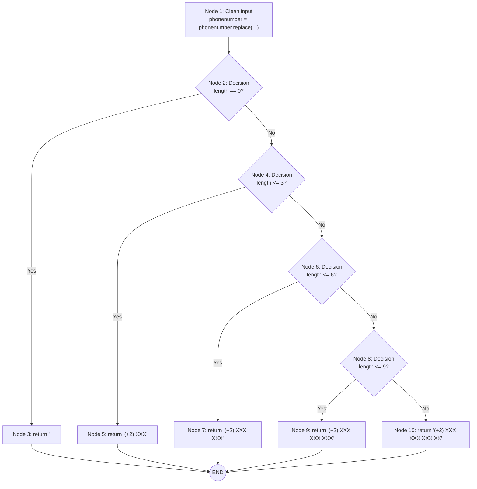

# DentWise White Box Testing

## Selected Function: `formatPhoneNumber`

**Source:** `src/lib/utils.ts` (lines 17-30)

```typescript
export const formatPhoneNumber = (phonenumber: string) => {
  // Node 1: Remove all non-digits
  phonenumber = phonenumber.replace(/\(\+\d\)|\D/g, "").trim();

  // Node 2: Decision - length == 0
  if (phonenumber.length == 0) return ""; // Node 3

  // Node 4: Decision - length <= 3
  if (phonenumber.length <= 3) return `(+2) ${phonenumber.slice(0, 3)}`; // Node 5

  // Node 6: Decision - length <= 6
  if (phonenumber.length <= 6)
    return `(+2) ${phonenumber.slice(0, 3)} ${phonenumber.slice(3)}`; // Node 7

  // Node 8: Decision - length <= 9
  if (phonenumber.length <= 9)
    return `(+2) ${phonenumber.slice(0, 3)} ${phonenumber.slice(3, 6)} ${phonenumber.slice(6)}`; // Node 9

  // Node 10: Default return (length > 9)
  return `(+2) ${phonenumber.slice(0, 3)} ${phonenumber.slice(3, 6)} ${phonenumber.slice(6, 9)} ${phonenumber.slice(9, 11)}`;
};
```

---

## Control Flow Graph (CFG)



---

## Cyclomatic Complexity Calculation

### Method 1: E - N + 2P

- **Edges (E):** 13
- **Nodes (N):** 11 (including END)
- **Connected Components (P):** 1

**V(G) = 13 - 11 + 2(1) = 4**

### Method 2: Decision Nodes + 1

- **Decision Nodes:** 4 (Nodes 2, 4, 6, 8)

**V(G) = 4 + 1 = 5**

### Cyclomatic Complexity: **5**

This means we need **5 independent paths** to achieve 100% path coverage.

---

## Independent Paths

| Path       | Condition      | Input Example   | Expected Output         |
| ---------- | -------------- | --------------- | ----------------------- |
| **Path 1** | length == 0    | `""` or `"abc"` | `""`                    |
| **Path 2** | 0 < length ≤ 3 | `"123"`         | `"(+2) 123"`            |
| **Path 3** | 3 < length ≤ 6 | `"123456"`      | `"(+2) 123 456"`        |
| **Path 4** | 6 < length ≤ 9 | `"123456789"`   | `"(+2) 123 456 789"`    |
| **Path 5** | length > 9     | `"01124555246"` | `"(+2) 011 245 552 46"` |

---

## Java Implementation

**File:** `junit/src/main/java/com/example/PhoneFormatter.java`

```java
public class PhoneFormatter {
    public static String formatPhoneNumber(String phonenumber) {
        // Node 1: Remove all non-digits
        phonenumber = phonenumber.replaceAll("[^0-9]", "").trim();

        // Node 2: Decision - length == 0
        if (phonenumber.length() == 0)
            return "";  // Path 1

        // Node 4: Decision - length <= 3
        if (phonenumber.length() <= 3)
            return "(+2) " + phonenumber.substring(0, phonenumber.length());  // Path 2

        // Node 6: Decision - length <= 6
        if (phonenumber.length() <= 6)
            return "(+2) " + phonenumber.substring(0, 3) + " " + phonenumber.substring(3);  // Path 3

        // Node 8: Decision - length <= 9
        if (phonenumber.length() <= 9)
            return "(+2) " + phonenumber.substring(0, 3) + " " +
                   phonenumber.substring(3, 6) + " " + phonenumber.substring(6);  // Path 4

        // Node 10: Default (length > 9)
        return "(+2) " + phonenumber.substring(0, 3) + " " +
               phonenumber.substring(3, 6) + " " +
               phonenumber.substring(6, 9) + " " +
               phonenumber.substring(9, Math.min(11, phonenumber.length()));  // Path 5
    }
}
```

---

## JUnit Test Cases

**File:** `junit/src/test/java/com/example/PhoneFormatterTest.java`

Each test covers one independent path from the CFG:

| Test Method               | Path Covered | Input           | Expected                |
| ------------------------- | ------------ | --------------- | ----------------------- |
| `testPath1_EmptyInput`    | Path 1       | `""`            | `""`                    |
| `testPath1_NonDigitsOnly` | Path 1       | `"abc"`         | `""`                    |
| `testPath2_ThreeDigits`   | Path 2       | `"123"`         | `"(+2) 123"`            |
| `testPath3_SixDigits`     | Path 3       | `"123456"`      | `"(+2) 123 456"`        |
| `testPath4_NineDigits`    | Path 4       | `"123456789"`   | `"(+2) 123 456 789"`    |
| `testPath5_ElevenDigits`  | Path 5       | `"01124555246"` | `"(+2) 011 245 552 46"` |

---

## Running the Tests

```bash
cd junit
mvn test
```
